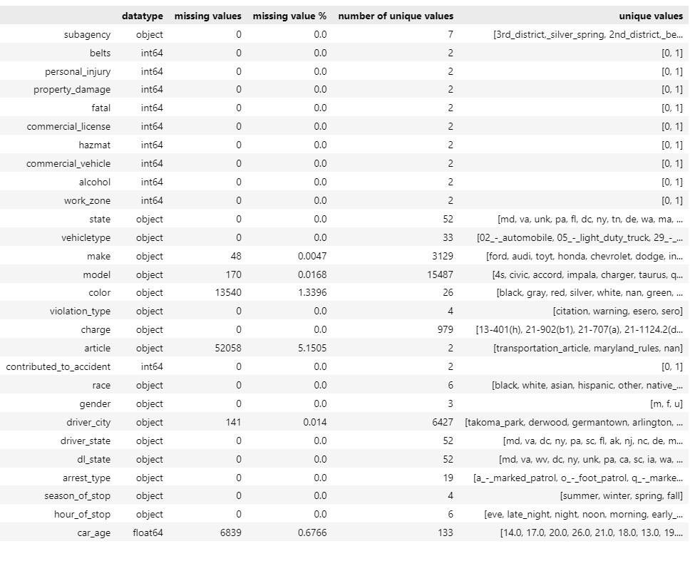
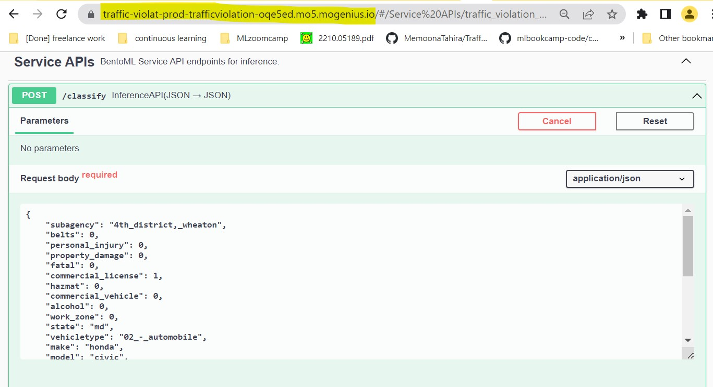

# Traffic Violation Type Prediction Service


Project done in partial fulfilment for the certification of MLZoomcamp2022 by DataTalks.Club. Details can be found [here](https://github.com/alexeygrigorev/mlbookcamp-code/blob/master/course-zoomcamp/cohorts/2022/projects.md#midterm-project).


Click on the image to test the service:

<p align="center">
  <a href="https://traffic-violat-prod-trafficviolation-seanb6.mo5.mogenius.io/#/Service%20APIs/traffic_violation_classifier__classify"></a>
</p>

# Problem

Classify a traffic violation into 4 categories based on the level, severity and type of violation. The 4 different types of violations are:

- **Citation:** A written record of something wrong while operating a vehicle or while parked. Examples: Speeding tickets, Running a red light/stop sign, Driving under the influence (DUI), Failure to signal
- **Warning:** A warning is issued by the officer is a statement that the motorist has committed some offense, but is being spared the actual citation. Officers use their own discretion whether to issue a citation or warning.
- **ESERO:** Electronic Safety Equipment Repair Order
- **SERO:** Safety Equipment Repair Order

The data is from Maryland Capitol Police Department.The mojor challenge of the problem is working almost entirely with categorical variables and very high cardinality of features.

# Dataset

The original dataset can be found [here](https://www.kaggle.com/datasets/felix4guti/traffic-violations-in-usa?select=Traffic_Violations.csv) on Kaggle.

This dataset is very untidy, so a cleaned version after doing cleaning and EDA in this [notebook](./TrafficViolation_Clean_EDA%20final.ipynb) can be found [here](https://github.com/MemoonaTahira/Traffic_Violation_Classification/releases/download/latest/cleaned_traffic_violations.csv). Dataset download links are added to all code file.

These are dataset stats after initial cleaning and feature engineering (basically everything that needs to be done before train-test split).

<p align="center">
    
</p>

The dimensions of the dataset are: `Dataframe dimensions: (1010737, 28)`

**The major work done on features:**

- Removing duplicates
- Reomving description of location in words(whose logitude/latitude are given), longitude, latitude and geolocation (which was a tuple of logitude and latitude), in favour of subagency, which basically denotes 7 zones where traffic violations were recorded. In absense of subagency, geolocation would have to be binned into zones.
- Removing features such as agency and accident that had only one value/category.
- Lowercasing column names and string variable
- Converting bool columns to 0 and 1
- Converting date to seasons by binning months, called season_of_stop
- Convrting time to portion of day called hour_of_stop, e.g. late night or afternoon, using binning on hours.
- Removing anamoly from year of car, e.g. year below 0 or beyond 2022, and converting it to car_age

**On target variable:**

The traffic_violation is the target variable with 4 values:

```
citation    0.486215
warning     0.462300
esero       0.050579
sero        0.000906
Name: violation_type, dtype: float64
```

Since sero is not even 0.01 of the dataset, it is combined with esero, which itself it the minority class at about 5%. We still have a class imbalance but it is manageable as just as seen below:

<p align="center">

</p>

# Methodology

The methodology followed is CRISP-DM, with roughly the same outline as week 1-7 of [MLZoomcamp](https://github.com/alexeygrigorev/mlbookcamp-code/tree/master/course-zoomcamp).

We start with data cleaing and EDA, and then feature engineering and feature selection, while doing doing missing value imputations, scaling, one-hot encoding and dimensionality reduction.

Once we have a cleaned dataset, we train it on fine-tuned linear and tree based models and use validation set to select best model. The best model is the trained on full train data, and tested one last time on withheld dataset.

Finally, the model is containerized with BentoML and deployed as a classification service to predict the type of traffic violation.


Full workflow [here](./TrafficViolation_Clean_EDA%20final.ipynb) in this jupyter notebook.


<p align="center">

</p>


# Reproducibility

The whole project is reproducible, ideally via bentoML. Here are details how to recreate the project at every step:

## 1. Create conda environment:

Create a conda environement from requirement.txt file using the requirement.txt file [here](./requirements.txt):

```
conda create --name traffic_classify --file requirements.txt
```

(P.S. If you want to use a pip environment, you can also use [pip-requirement.txt](./pip_requirements.txt) to install it.)

Using the newly created conda environement, explore the notebook for cleaning, EDA feature engineering and selecting best model, which is the [TrafficViolation_Clean_EDA.ipynb](./TrafficViolation_Clean_EDA.ipynb)

## 2. Analysis and Results:

Have a look at model pipelines (Logistic Regression, Random Forest and XGBoost) and detailed results [here](./results.md).

<p align="center"> <a href="https://github.com/MemoonaTahira/Traffic_Violation_Classification/blob/main/results.md"></a>
</p>

## 3. Train the final model:

Using the same environment as before, i.e. traffic_classify:

Run the final_train.py file to train the best model with tuned parameters on the cleaned dataset. In a terminal with the traffic_classify environment activated, run this:

`python final_Train.py`

It will save these items:

- xgboost_traffic_violation_model.sav
- sklearn_pipeline.pkl
- bentoML model with both the xgboost final model and custom pipeline object

The first two are for reference to avoid complete retraining, but the last model is the one we will use throughout in the next steps.

Check that your model saved correctly by running `bentoml models list`

<!-- ## 4. (Optional) Build the BentoML model and serve it locally:

Run from terminal with conda env traffic_classify activated:

```
bentoml serve service.py:svc --reload
```

This step tests the bentoML model before converting it to a service. This step is great for development as the service automatically keep reloading to reflect any changes. -->

## 4. Build the BentoML service and serve it locally:

- First, get list of models stored in the bentoml models directory

`bentoml models list`

- Get name and tag of the model you want, e.g. in my case:

`"traffic_violation_classification:c3zxrptavo3q4vhb"`

- Use you own model name and tag in [service.py](./service.py) in line 9, and make sure to use it with quotes included, i.e. `"traffic_violation_classification:c3zxrptavo3q4vhb"`

- Build the bentoML service.

`bentoml build`

- And you'll see this:

<p align="center">

</p>

- Serve the container by running this is the terminal:

`bentoml serve --production`

- Now you can test your bentoML service now running a classification service locally as explained in next step.

## 5. Using Swagger UI once the service is runnnig locally:

Go to any browser and open this link: 0.0.0.0:3000 OR localhost:3000

It will open the Swagger UI which looks like this:

<div style="text-align:center">

</div>

Click on "try it out" and paste the sample test user given below and click execute:

    {
    "subagency": "4th_district,_wheaton",
    "belts": 0,
    "personal_injury": 0,
    "property_damage": 0,
    "fatal": 0,
    "commercial_license": 1,
    "hazmat": 0,
    "commercial_vehicle": 0,
    "alcohol": 0,
    "work_zone": 0,
    "state": "md",
    "vehicletype": "02_-_automobile",
    "make": "honda",
    "model": "civic",
    "color": "red",
    "charge": "21-904(b2)",
    "article": "transportation_article",
    "contributed_to_accident": 0,
    "race": "hispanic",
    "gender": "m",
    "driver_city": "silver_spring",
    "driver_state": "md",
    "dl_state": "md",
    "arrest_type": "a_-_marked_patrol",
    "season_of_stop": "summer",
    "hour_of_stop": "late_night",
    "car_age": 28.0
    }

<p align="center">

</p>

You should see a result like this:

<p align="center">

</p>

<!-- ## 6. Do load testing with locust:

open another tab in your browser while the `bentoml serve --production` command is running from terminal and run:

`locust -H <http://localhost:3000>`

Do load testing if you want to see if the model can handle appopriate load before deploying it as service to cloud. -->

## 6. Dockerize the bentoML service:

Start your docker service:
`sudo dockerd`

Open a new terminal tab and build your bentoML container:

```
cd bentoml/bentos/
tree
# copy name and tag of the service we built in step 5:
# Note: Models are located in /bentoml/models and have a different name and tag from BentoML services that are
# located in /bentoml/bentos
bentoml containerize traffic_violation_classifier:ga4yxpdbbc676aav
```

It will take a moment to build the container. Once it is done, serve the container locally:

`docker run -it --rm -p 3000:3000 traffic_violation_classifier:ga4yxpdbbc676aav serve`

Test it using same steps as before from [here](#5-using-swagger-ui-once-the-service-is-runnnig-locally)

## 7. Deployment of bentoML as a service to Cloud:

I will deploy my docker image (traffic_violation_classifier:ga4yxpdbbc676aav) from step 8 to Mogenius, but for that I need to first push my image to DockerHub.

## 8: Setting up DockerHub:

- Create an account and verify it
- Choose free plan and create a repository with a name that reflects your service, e.g. traffic_violation_classification
- Go to your username in the top righ of the DockerHub tab, and go to Account Setting, go to security and generate a new access token.
- From your local terminal, with sudo dockerd running, run the following:
- Enter `docker login -u username` from terminal and then enter access token when asked for password.
- Once you are authenticated, run `docker images` to find a list of docker images available.
- Next retag the image like this:
`docker tag <existing-image> <hub-user>/<repo-name>[:<tag>]`
- E.g. in my case it would look like this:
`docker tag traffic_violation_classifier:tr32cwtbfs7viaav memoonatahira/traffic_violation_classification:deployment_testing`
- Push the image to DockerHub:
`docker push <hub-user>/<repo-name>[:<tag>]`
- In my case it looks like this:
`docker push memoonatahira/traffic_violation_classification:deployment_testing`
- It'll take a moment and you'll be done!

## 9. Pull bentoML service docker image from DockerHub and run it locally:

You can skip all the previous steps, and just pull the bentoML image from DockerHub and build a container and run it via docker like this:

```
docker pull memoonatahira/traffic_violation_classification:deployment_testing
docker run -it --rm -p 3000:3000 memoonatahira/traffic_violation_classification:deployment_testing serve --production
```

Test it using same steps as before from [here](#5-using-swagger-ui-once-the-service-is-runnnig-locally)

## 12. Deploy the BentoML container to Mogenius:

- Create an account on Mobegenius: <https://studio.mogenius.com/user/registration>
- Verfiy your account and select the free plan
- Create a cloud space with a reflective name, e.g. TrafficViolation
- Choose Create from docker image from any registry
- Give the service a name, and then add address of your image. E.g.
`memoonatahira/traffic_violation_classification:deployment_testing`
- Select **Stage** as "production" and leave everything as is
- Add 3000 to HTTPS port at the very end and hit **"Create Service"**
- Increase the resources (I set all reseources to maximum) for your service and click on **"Save Changes"**
- You should see something like this:

<p align="center">

</p>

- Click on **"HostName"** in the top right, and click on External domain, and it should be up and running here:
 <https://traffic-violat-prod-trafficviolation-oqe5ed.mo5.mogenius.io/>
- Test the service: It will open the familiar Swaggr UI and you can test it using same steps as before from [here](#5-using-swagger-ui-once-the-service-is-runnnig-locally)

<p align="center">

</p>
 
- The response:

<p align="center">

</p>

All done. :)


